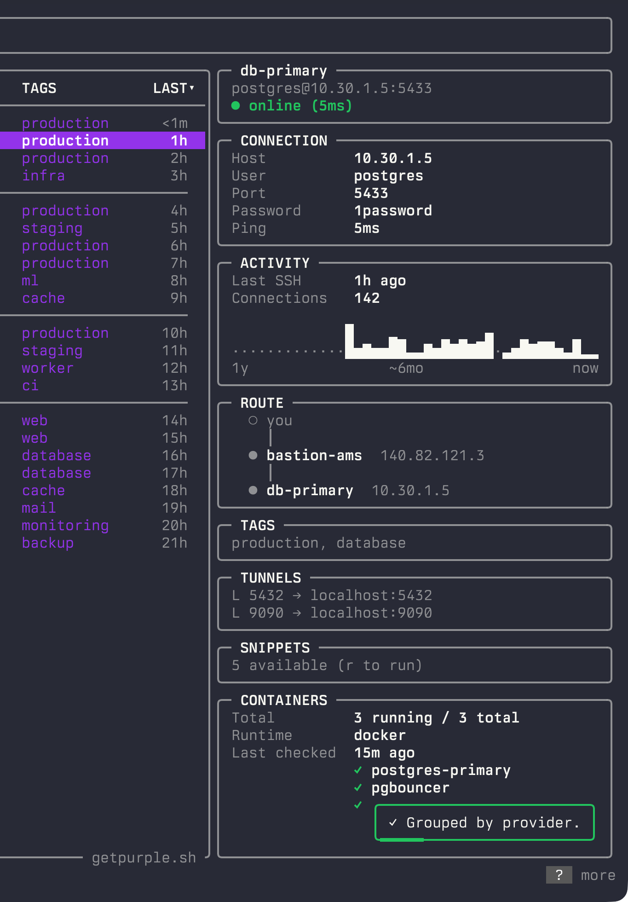
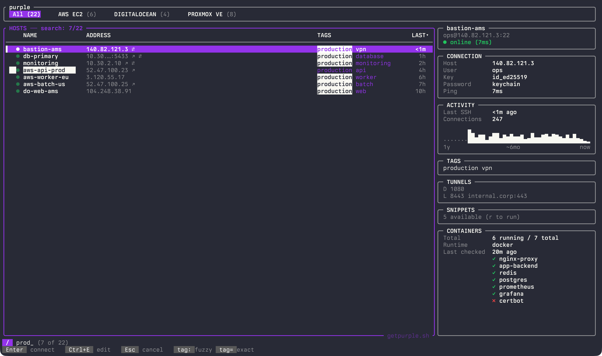
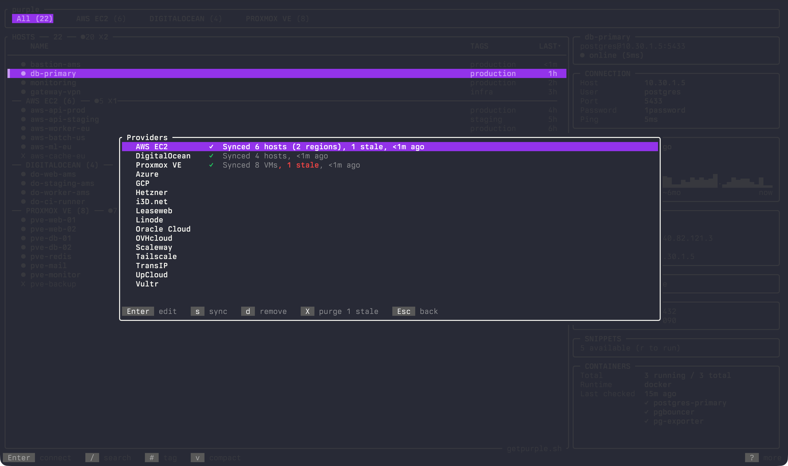
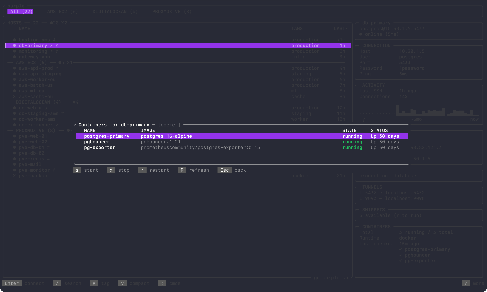

# purple

**A terminal cockpit for your servers.** Search, connect, transfer files, manage containers and run commands across hosts. All keyboard-driven. Free and open source.

[](https://crates.io/crates/purple-ssh)
[](https://crates.io/crates/purple-ssh)
[](LICENSE)
[](https://ratatui.rs/)
[](https://getpurple.sh)


## Install

```
curl -fsSL getpurple.sh | sh
```

<details>
<summary>brew, cargo or from source</summary>

```
brew install erickochen/purple/purple
```
```
cargo install purple-ssh
```
```
git clone https://github.com/erickochen/purple.git
cd purple && cargo build --release
```
</details>

Run `purple`. Press `?` on any screen for help. That's it.

## Why I built this

My SSH config was fine. Proper aliases, ProxyJump chains, organized by provider. Not the problem.

The problem was everything around it. Need to check a container? `ssh host docker ps`. Copy a file? `scp` with the right flags. Run the same command on ten hosts? Write a loop or boot up Ansible for a one-liner. Spin up a VM on Hetzner? Open the console, grab the IP, edit config, save. Someone asks which box runs what? Good luck.

I wanted one place for all of that. So I built it.

## What you get



🔍 **Everything at a glance.** Connection info, jump route, activity sparkline, tags, tunnels, snippets, containers and server metadata. Health dots show which hosts are up. Group by provider, tag or flat.

<br clear="both">
<br>

⚡ **Instant fuzzy search.** Names, IPs, tags, users. Frecency sorting puts your most-used hosts on top. Works the same with 5 hosts or 500. Scoped search within groups.



☁️ **16 cloud providers.** AWS, DigitalOcean, Hetzner, GCP, Azure, Proxmox VE, Vultr, Linode, UpCloud, Scaleway, Tailscale, Oracle Cloud, OVHcloud, Leaseweb, i3D.net and TransIP. VMs appear, IPs update, stale hosts dim. Region, instance type, OS and status synced as metadata.



🐳 **Containers over SSH.** Docker and Podman. Start, stop, restart. No agent on the remote, no extra ports. Just SSH.



**And more.** Visual file transfer with split-pane explorer. Multi-host command execution with snippets. Automatic password retrieval from OS Keychain, 1Password, Bitwarden, pass and the HashiCorp Vault KV secrets engine. Short-lived SSH certificates signed via the HashiCorp Vault SSH secrets engine. MCP server for AI agents like Claude Code and Cursor. See the [wiki](https://github.com/erickochen/purple/wiki) for details.

## How it works

purple reads `~/.ssh/config` directly. No database, no daemon, no account. Comments, indentation, Include files, unknown directives. All preserved.

Written in Rust. Single binary. 6000+ tests. MIT license.

## Links

📖 [Wiki](https://github.com/erickochen/purple/wiki) · ☁️ [Cloud Providers](https://github.com/erickochen/purple/wiki/Cloud-Providers) · 🤖 [MCP Server](https://github.com/erickochen/purple/wiki/MCP-Server) · ❓ [FAQ](https://github.com/erickochen/purple/wiki/FAQ) · 🔒 [Security](SECURITY.md) · 🧠 [llms.txt](https://getpurple.sh/llms.txt)

## Feedback

Bug or feature request? [Open an issue](https://github.com/erickochen/purple/issues).
