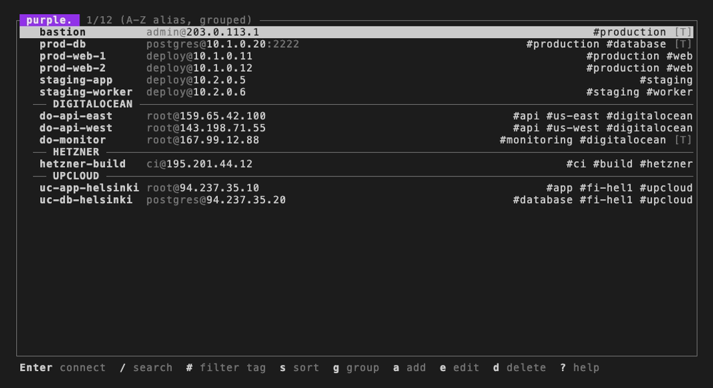

<h1 align="center">purple.<br>SSH config manager with file transfer<br>and cloud sync.</h1>

<p align="center">
  <strong>Stop scrolling through your SSH config. Start searching it.</strong><br>
  Find any server instantly, connect with Enter, transfer files visually and sync from 10 cloud providers. One TUI that edits your <code>~/.ssh/config</code> directly.
</p>

<p align="center">
  <a href="https://crates.io/crates/purple-ssh"></a>
  <a href="https://crates.io/crates/purple-ssh"></a>
  <a href="LICENSE"></a>
  <a href="https://getpurple.sh"></a>
</p>

<p align="center"></p>

## What is purple?

purple turns your `~/.ssh/config` into a searchable, visual interface. Find any host instantly, connect with Enter, browse remote files side by side and sync servers from ten cloud providers. One TUI. No context switching.

It reads your existing config, lets you search, filter, tag and connect with a single keystroke, and writes changes back without touching your comments or unknown directives. Transfer files visually, run commands across servers and handle SSH passwords automatically. Free, open-source, runs on macOS and Linux.

## Install

```bash
curl -fsSL getpurple.sh | sh
```

<details>
<summary>Other install methods</summary>

<br>

**Homebrew (macOS)**

```bash
brew install erickochen/purple/purple
```

**Cargo** (crate name: `purple-ssh`)

```bash
cargo install purple-ssh
```

**From source**

```bash
git clone https://github.com/erickochen/purple.git
cd purple && cargo build --release
```

</details>

## Self-update

```bash
purple update
```

Downloads the latest release from GitHub, verifies the checksum and replaces the binary in place. macOS only (installed via `curl`). Homebrew users should run `brew upgrade erickochen/purple/purple` instead. Cargo users should run `cargo install purple-ssh`. The TUI also checks for updates on startup and shows a notification in the title bar when a new version is available.

## Features

### Search and connect

Find any host in under a second, no matter how large your config. Instant fuzzy search across aliases, hostnames, users, tags and providers. Navigate with `j`/`k`, connect with `Enter`. Frecency sorting surfaces your most-used and most-recent hosts.

### Tags

Organize hosts by environment, team or project without external tools. Label hosts with `#tags`. Filter with the tag picker (`#` key) or type `tag:web` in search. Tags are stored as SSH config comments and survive round-trips.

### Cloud provider sync

Never manually add a server IP to your SSH config again. Pull servers from **AWS EC2**, **DigitalOcean**, **Vultr**, **Linode (Akamai)**, **Hetzner**, **UpCloud**, **Proxmox VE**, **Scaleway**, **GCP (Compute Engine)** and **Azure** directly into `~/.ssh/config`. Sync adds new hosts, updates changed IPs and optionally removes deleted servers. Tags from your cloud provider are merged with local tags.

```bash
purple provider add digitalocean --token YOUR_TOKEN   # or use PURPLE_TOKEN env var
purple provider add digitalocean --token-stdin         # pipe from password manager
purple provider add aws --profile default --regions us-east-1,eu-west-1
purple provider add aws --token AKID:SECRET --regions us-east-1,eu-west-1
purple provider add proxmox --url https://pve:8006 --token user@pam!token=secret
purple provider add gcp --token /path/to/sa-key.json --project my-project --regions us-central1-a
purple provider add azure --token /path/to/sp.json --regions SUBSCRIPTION_ID
purple provider add digitalocean --token YOUR_TOKEN --no-auto-sync  # disable startup sync
purple sync                                            # sync all providers
purple sync --dry-run                                  # preview changes
purple sync --remove                                   # remove deleted hosts
purple sync --reset-tags                               # replace local tags with provider tags
```

Synced hosts are tagged by provider and appear alongside your manual hosts. Auto-sync runs on startup for providers that have it enabled (configurable per provider). The provider list is sorted by last sync time and shows sync results.

### SSH tunnel management

Add, edit and manage LocalForward, RemoteForward and DynamicForward rules per host. Start and stop background SSH tunnels from the TUI or CLI.

```bash
purple tunnel list
purple tunnel add myserver L:8080:localhost:80
purple tunnel start myserver
```

### Command snippets

Save frequently used commands and run them on one host, a selection of hosts or all visible hosts at once. Multi-host execution runs sequentially in the TUI and supports parallel mode on the CLI. Snippets are stored in `~/.purple/snippets` and managed from the TUI or CLI.

```bash
purple snippet add check-disk "df -h" --description "Check disk usage"
purple snippet add uptime "uptime"
purple snippet run check-disk myserver             # run on single host
purple snippet run check-disk --tag prod           # run on all hosts with tag
purple snippet run check-disk --all                # run on all hosts
purple snippet run check-disk --all --parallel     # run concurrently
purple snippet list                                # list all snippets
purple snippet remove check-disk                   # remove a snippet
```

In the TUI, press `r` to run a snippet on the selected host. Select multiple hosts with `Ctrl+Space` and press `r` to run on all selected. Press `R` to run on all visible hosts.

### Remote file explorer

Press `f` on any host to open a split-screen file explorer. Your local filesystem on the left, the remote server on the right. Navigate directories, select files and copy them between machines with `Enter`. No more constructing scp paths from memory.

The explorer uses your existing SSH config. ProxyJump chains, password sources and active tunnels all work transparently. Select multiple files with `Ctrl+Space` or select all with `Ctrl+A`. Copy entire directories and confirm the transfer direction before anything moves. Toggle hidden files with `.` and refresh both panes with `R`. Paths are remembered per host so you pick up where you left off.

### Round-trip fidelity

Comments, indentation, unknown directives, CRLF line endings, equals-syntax and inline comments are all preserved through every read-write cycle. Consecutive blank lines are collapsed. Hosts from `Include` files are displayed but never modified.

### Bulk import

Import hosts from a hosts file or `~/.ssh/known_hosts`. No manual re-entry.

```bash
purple import hosts.txt
purple import --known-hosts
```

### Password management

Configure a password source per host. Press `Enter` on the Password Source field in the host form to pick a source from the overlay or type it directly. Purple acts as its own SSH_ASKPASS program and retrieves passwords automatically on connect.

Supported sources: **OS Keychain**, **1Password** (`op://`), **Bitwarden** (`bw:`), **pass** (`pass:`), **HashiCorp Vault** (`vault:`) or any custom command. Press `Ctrl+D` in the password picker to set a source as the global default.

### SSH key management

Browse your SSH keys with metadata (type, bits, fingerprint, comment) and see which hosts reference each key.

### Additional features

- **Ping** TCP connectivity check per host or all at once (toggle to clear)
- **Clipboard** Copy the SSH command or full config block
- **Atomic writes** Temp file, chmod 600, rename. No half-written configs.
- **Automatic backups** Every write creates a timestamped backup (keeps the last 5)
- **Host key reset** Detects changed host keys after a server reinstall and offers to remove the old key and reconnect
- **Auto-reload** Detects external config changes and reloads automatically
- **Detail panel** Split-pane view showing connection info, activity sparkline, tags, provider metadata, tunnels and snippets alongside the host list. Toggle with `v`
- **Minimal UI** Monochrome with subtle color for status messages. Works in any terminal, any font. Respects [NO_COLOR](https://no-color.org/)
- **Shell completions** Bash, zsh and fish via `purple --completions`

## Usage

```bash
purple                              # Launch the TUI
purple myserver                     # Connect or search
purple -c myserver                  # Direct connect
purple --config ~/other/ssh_config  # Use alternate config file
purple --list                       # List all hosts
purple add deploy@10.0.1.5:22      # Quick-add a host
purple add user@host --alias name   # Quick-add with custom alias
purple add user@host --key ~/.ssh/id_ed25519  # Quick-add with key
purple import hosts.txt             # Bulk import from file
purple import --known-hosts         # Import from known_hosts
purple provider add digitalocean    # Configure cloud provider
purple provider list                # List configured providers
purple provider remove digitalocean # Remove provider
purple sync                         # Sync all providers
purple sync digitalocean            # Sync single provider
purple sync --dry-run               # Preview sync changes
purple sync --remove                # Remove hosts deleted from provider
purple sync --reset-tags            # Replace local tags with provider tags
purple tunnel list                  # List configured tunnels
purple tunnel list myserver         # List tunnels for a host
purple tunnel add myserver L:8080:localhost:80  # Add forward
purple tunnel remove myserver L:8080:localhost:80  # Remove forward
purple tunnel start myserver        # Start tunnel (Ctrl+C to stop)
purple snippet list                 # List saved snippets
purple snippet add NAME "COMMAND"   # Add a snippet
purple snippet remove NAME          # Remove a snippet
purple snippet run NAME myserver    # Run on a host
purple snippet run NAME --tag prod  # Run on hosts with tag
purple snippet run NAME --all       # Run on all hosts
purple snippet run NAME --all --parallel  # Run concurrently
purple password set myserver        # Store password in OS keychain
purple password remove myserver     # Remove password from keychain
purple update                       # Update to latest version
purple --completions zsh            # Shell completions
```

<details>
<summary><strong>Keybindings</strong>. Press <code>?</code> in the TUI for the cheat sheet</summary>

<br>

**Host List**

| Key         | Action                           |
| ----------- | -------------------------------- |
| `j` / `k`   | Navigate down and up             |
| `PgDn`/`PgUp`| Page down / up                  |
| `Enter`     | Connect to selected host         |
| `a`         | Add new host                     |
| `e`         | Edit selected host               |
| `d`         | Delete selected host             |
| `c`         | Clone host                       |
| `y`         | Copy SSH command                 |
| `x`         | Export config block to clipboard |
| `/`         | Search and filter                |
| `#`         | Filter by tag                    |
| `t`         | Tag host                         |
| `s`         | Cycle sort mode                  |
| `g`         | Group by provider                |
| `i`         | Inspect host details             |
| `v`         | Toggle detail panel              |
| `u`         | Undo last delete                 |
| `p`         | Ping selected host (toggle)      |
| `P`         | Ping all hosts (toggle)          |
| `S`         | Cloud provider sync              |
| `Ctrl+Space`| Select / deselect host           |
| `r`         | Run snippet on host(s)           |
| `R`         | Run snippet on all visible       |
| `f`         | Remote file explorer (scp)       |
| `T`         | Manage host tunnels              |
| `K`         | SSH key list                     |
| `?`         | Help                             |
| `q` / `Esc` | Quit                             |

**Tunnel List**

| Key         | Action                 |
| ----------- | ---------------------- |
| `j` / `k`   | Navigate down and up   |
| `Enter`     | Start / stop tunnel    |
| `a`         | Add tunnel             |
| `e`         | Edit tunnel            |
| `d`         | Delete tunnel          |
| `q` / `Esc` | Back                   |

**Provider List**

| Key         | Action                 |
| ----------- | ---------------------- |
| `j` / `k`   | Navigate down and up   |
| `Enter`     | Configure provider     |
| `s`         | Sync selected provider |
| `d`         | Remove provider        |
| `q` / `Esc` | Back (cancels syncs)   |

**Snippet Picker**

| Key         | Action                 |
| ----------- | ---------------------- |
| `j` / `k`   | Navigate down and up   |
| `Enter`     | Run snippet            |
| `a`         | Add snippet            |
| `e`         | Edit snippet           |
| `d`         | Delete snippet         |
| `q` / `Esc` | Back                   |

**File Explorer** (press `f` on a host)

| Key         | Action                 |
| ----------- | ---------------------- |
| `Tab`       | Switch pane            |
| `j` / `k`   | Navigate               |
| `Enter`     | Open directory / copy  |
| `Backspace` | Go up                  |
| `Ctrl+Space`| Select / deselect      |
| `Ctrl+A`   | Select all / none       |
| `.`         | Toggle hidden files    |
| `R`         | Refresh both panes     |
| `Esc`       | Close                  |

**Search**

| Key                 | Action                 |
| ------------------- | ---------------------- |
| Type                | Filter hosts           |
| `Enter`             | Connect to selected    |
| `Esc`               | Cancel search          |
| `Tab` / `Shift+Tab` | Next / previous result |
| `tag:name`          | Fuzzy tag filter       |
| `tag=name`          | Exact tag filter       |

**Form**

| Key                 | Action                                     |
| ------------------- | ------------------------------------------ |
| `Tab` / `Shift+Tab` | Next / previous field                      |
| `Enter`             | Save (or pick key/password on those fields)|
| `Ctrl+D`            | Set global default (in password picker)    |
| `Esc`               | Cancel                                     |

</details>

## How purple compares

Most SSH tools read your config but don't write it, sync one cloud but not ten, or require a GUI and a subscription. purple does all of it from the terminal.

**It edits your real SSH config.** Most SSH tools only read. purple reads, edits and writes `~/.ssh/config` directly with full round-trip fidelity.

**It syncs cloud servers.** purple is the only SSH config manager that pulls hosts from 10 cloud providers into your config. Configure once, sync anytime.

**It runs commands across hosts.** Save command snippets and execute them on one host, a selection or all hosts at once. Sequential or parallel. No Ansible, no Fabric, no extra tools.

**It manages SSH passwords.** Store passwords in your OS keychain or pull them from 1Password, Bitwarden, pass, HashiCorp Vault or a custom command. Purple handles SSH_ASKPASS automatically.

**It transfers files visually.** Open a split-screen file explorer on any host, browse remote directories alongside local ones and copy files with a keystroke. No scp paths to remember, no separate tool to open.

**It imports what you already have.** Bulk import from host files or `~/.ssh/known_hosts`. No manual re-entry.

**Single Rust binary.** No runtime, no daemon, no async framework, no Node.js, no Python. Install and run. Works on macOS and Linux.

## Cloud providers

purple syncs servers from ten cloud providers into your SSH config. Each provider is configured with an API token (or AWS credentials profile). Synced hosts get an alias prefix (e.g. `do-web-1`) and are tracked via comments in your config. Provider metadata (region, plan, OS, status. Proxmox: node, type, status) is stored in config comments and displayed in the detail panel. Run `purple sync` to update all providers at once. Auto-sync runs on startup for providers that have it enabled.

### AWS EC2

Syncs running EC2 instances across multiple regions. Authenticate with an `~/.aws/credentials` profile or an explicit access key pair. AMI names are resolved for OS metadata. Tags from EC2 are synced (excluding internal `aws:*` tags).

```bash
purple provider add aws --profile default --regions us-east-1,eu-west-1
purple provider add aws --token AKID:SECRET --regions us-east-1,eu-west-1
```

### DigitalOcean

Syncs all Droplets. Uses the DigitalOcean API v2 with page-based pagination. Droplet tags are synced as purple tags. Requires a personal access token.

```bash
purple provider add digitalocean --token YOUR_TOKEN
```

### Vultr

Syncs all instances. Uses the Vultr API v2 with cursor-based pagination. Prefers IPv4. Falls back to IPv6 when no v4 address is available. Instance tags are synced.

```bash
purple provider add vultr --token YOUR_TOKEN
```

### Linode (Akamai)

Syncs all Linodes. Uses the Linode API v4 with page-based pagination. Filters out private and reserved IP addresses (10.x, 172.16-31.x, 192.168.x, CGNAT). Instance tags are synced.

```bash
purple provider add linode --token YOUR_TOKEN
```

### Hetzner

Syncs all servers from Hetzner Cloud. Uses page-based pagination. Hetzner labels (key-value pairs) are converted to tags in `key=value` format.

```bash
purple provider add hetzner --token YOUR_TOKEN
```

### UpCloud

Syncs all servers. Uses the UpCloud API with Bearer token authentication. Requires N+1 API calls (one list request, then one detail request per server to get IP addresses). Tags and labels are both synced.

```bash
purple provider add upcloud --token YOUR_TOKEN
```

### Proxmox VE

Syncs QEMU VMs and LXC containers from a Proxmox VE cluster. Requires an API token in `user@realm!tokenid=secret` format and the cluster URL. Uses N+1 API calls (cluster resources list, then per-VM detail requests). IP addresses are resolved via the QEMU guest agent or LXC network interfaces. Templates and stopped VMs are skipped. Supports self-signed TLS certificates with `--no-verify-tls`. Auto-sync is disabled by default due to the higher API call volume.

```bash
purple provider add proxmox --url https://pve.example.com:8006 --token user@pam!token=secret
purple provider add proxmox --url https://pve:8006 --token TOKEN --no-verify-tls
```

### Scaleway

Syncs instances across multiple availability zones (Paris, Amsterdam, Warsaw, Milan). Uses the Scaleway Instance API with `X-Auth-Token` header authentication and page-based pagination. Instance tags are synced. IP selection prefers public IPv4, falls back to IPv6 and then private IP.

```bash
purple provider add scaleway --token YOUR_TOKEN --regions fr-par-1,nl-ams-1
```

### GCP (Compute Engine)

Syncs instances across multiple zones using the aggregatedList API. Authenticate with a service account JSON key file or a raw access token (e.g. from `gcloud auth print-access-token`). Requires a GCP project ID. Instance network tags and labels are synced. IP selection prefers external (natIP), falls back to internal.

```bash
purple provider add gcp --token /path/to/sa-key.json --project my-project
purple provider add gcp --token /path/to/sa-key.json --project my-project --regions us-central1-a,europe-west1-b
purple provider add gcp --token "$(gcloud auth print-access-token)" --project my-project
```

### Azure

Syncs VMs across multiple subscriptions using the Azure Resource Manager API. Authenticate with a service principal JSON file (tenantId, clientId, clientSecret) or a raw Bearer token (e.g. from `az account get-access-token`). Requires at least one subscription ID. VM tags are synced. IP selection prefers public IP, falls back to private IP. Batch resolution (VMs, NICs, Public IPs) for efficient API usage.

```bash
purple provider add azure --token /path/to/sp.json --regions SUBSCRIPTION_ID
purple provider add azure --token /path/to/sp.json --regions SUB_ID_1,SUB_ID_2
purple provider add azure --token "$(az account get-access-token --query accessToken -o tsv)" --regions SUBSCRIPTION_ID
```

### Shared sync options

```bash
purple sync                     # sync all providers
purple sync --dry-run           # preview changes without writing
purple sync --remove            # remove hosts deleted from provider
purple sync --reset-tags        # replace local tags with provider tags
purple provider add NAME --no-auto-sync   # disable auto-sync on startup
```

## Password managers

purple can retrieve SSH passwords automatically when you connect. Configure a password source per host and purple takes care of the rest. No manual password entry, no plaintext passwords in your config.

### How it works

When you connect to a host that has a password source configured, purple sets itself as the SSH_ASKPASS program. SSH calls purple back to retrieve the password, and purple fetches it from whatever source you configured (keychain, 1Password, Bitwarden, etc.). This happens transparently. You press Enter to connect and the password is filled in automatically.

If the password turns out to be wrong, purple detects the retry (SSH calls ASKPASS again within 60 seconds) and falls back to the normal interactive password prompt so you don't get stuck in a loop.

Password sources are stored as comments in your SSH config (`# purple:askpass <source>`), so they survive edits and are visible if you open the config in a text editor.

### Setting a password source

**In the TUI.** Open the host form (`e` to edit, `a` to add), navigate to the Password Source field and press `Enter` to open the picker. Select a source and fill in the required details. Press `Ctrl+D` in the picker to set a source as the global default for all hosts that don't have one configured.

**From the CLI.** Use the password command for keychain entries, or edit the host form for other sources:

```bash
purple password set myserver        # prompts for password, stores in OS keychain
purple password remove myserver     # removes from keychain
```

### Supported sources

#### OS Keychain

Stores and retrieves passwords using macOS Keychain (`security`) or Linux Secret Service (`secret-tool`). This is the only source that stores the actual password. All other sources call an external tool at connect time.

When you connect for the first time with `keychain` as the source, purple prompts for the password and stores it. Subsequent connections retrieve it silently. Changing the source away from `keychain` removes the stored password automatically. Renaming a host alias migrates the keychain entry.

```
Source value: keychain
```

#### 1Password

Retrieves passwords using the `op` CLI. Requires 1Password CLI installed and authenticated. Uses the standard `op://` URI format to reference a specific vault, item and field.

```
Source value: op://Vault/Item/field
```

#### Bitwarden

Retrieves passwords using the `bw` CLI. Uses the item name or ID as the lookup key. When the vault is locked, purple prompts for your master password and caches the session for the remainder of the TUI session. Works with self-hosted Bitwarden and Vaultwarden (configure via `bw config server <url>`).

```
Source value: bw:item-name
```

#### pass (password-store)

Retrieves passwords from [pass](https://www.passwordstore.org/) (the standard Unix password manager). Returns the first line of the entry, following the pass convention.

```
Source value: pass:path/to/entry
```

#### HashiCorp Vault

Retrieves secrets using the `vault` CLI. Reads KV v2 secrets. Specify the path and field separated by `#`. Defaults to the `password` field if no field is specified. Requires `VAULT_ADDR` and authentication to be configured.

```
Source value: vault:secret/path#field
```

#### Custom command

Run any shell command that prints the password to stdout. The placeholders `%a` (alias) and `%h` (hostname) are substituted before execution. Useful for integrating with password managers or scripts that purple doesn't support natively.

```
Source value: my-script %a %h
```

## FAQ

**Can I transfer files with purple?**
Yes. Press `f` on any host to open the remote file explorer. It shows local files on the left and the remote server on the right. Navigate directories, select files and copy them between machines with `Enter`. Works through ProxyJump chains, password sources and active tunnels.

**What cloud providers does purple support?**
AWS EC2, DigitalOcean, Vultr, Linode (Akamai), Hetzner, UpCloud, Proxmox VE, Scaleway, GCP (Compute Engine) and Azure. See the [Cloud providers](#cloud-providers) section for setup details per provider.

**Does purple modify my existing SSH config?**
Only when you add, edit, delete or sync. Auto-sync runs on startup for providers that have it enabled (toggle per provider, on by default except Proxmox). All writes are atomic with automatic backups.

**Will purple break my comments or formatting?**
No. purple preserves comments, indentation and unknown directives through every read-write cycle. Consecutive blank lines are collapsed to one.

**Does purple need a daemon or background process?**
No. It's a single binary. Run it, use it, close it.

**Does purple send my SSH config anywhere?**
No. Your config never leaves your machine. Provider sync calls cloud APIs to fetch server lists. The TUI checks GitHub for new releases on startup (cached for 24 hours). No config data is transmitted in either case.

**Can I use purple with Include files?**
Yes. Hosts from Include files are displayed in the TUI but never modified. purple resolves Include directives recursively (up to depth 5) with tilde and glob expansion.

**How does password management work?**
Configure a password source per host (Enter on the Password Source field in the host form) and purple retrieves the password automatically when you connect via the SSH_ASKPASS mechanism. Six sources are supported: OS Keychain, 1Password, Bitwarden, pass, HashiCorp Vault and custom commands. See the [Password managers](#password-managers) section for details on each source and how to set them up.

**How does provider sync handle name conflicts?**
Synced hosts get an alias prefix (e.g. `do-web-1` for DigitalOcean). If a name collides with an existing host, purple appends a numeric suffix (`do-web-1-2`).

**Why is the crate called `purple-ssh`?**
The name `purple` was taken on crates.io. The binary is still called `purple`.

## Feedback

Found a bug or have a feature request? [Open an issue on GitHub](https://github.com/erickochen/purple/issues).

## Built with

Rust. 2900+ tests. Zero clippy warnings. No async runtime. Single binary.

<p align="center">
  <a href="LICENSE">MIT License</a>
</p>
